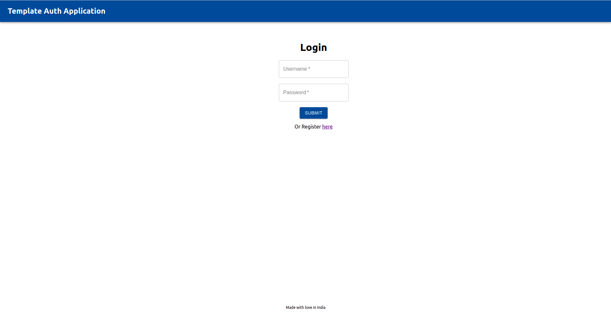
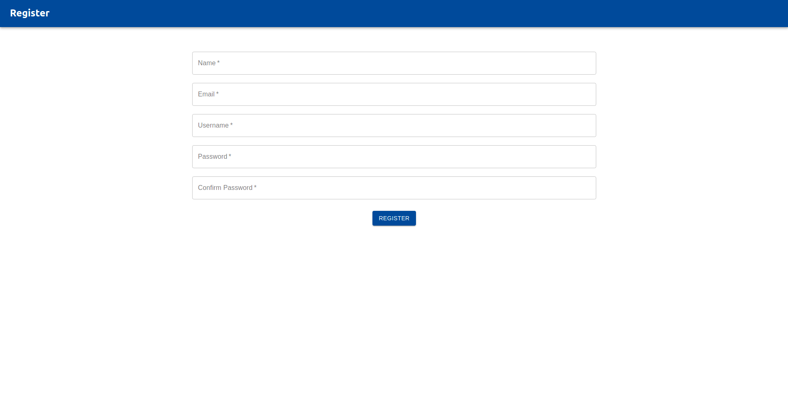
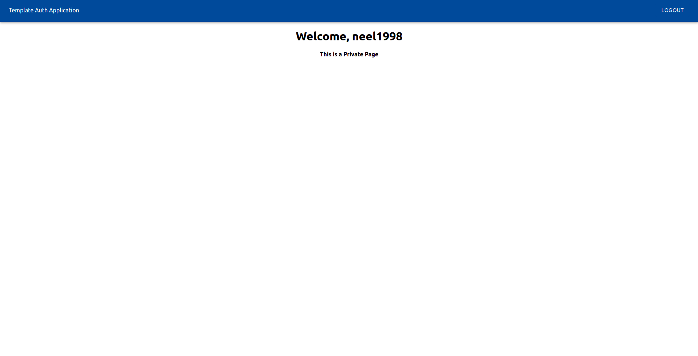

# Template Authentication Webapp

This repository contains the template code for authentication web application with backend server, database and front end client. Following are the main components:

- Backend Server: <b>Express.js</b>
- Frontend Client: <b>ReactJS</b>
- Database: <b>Sqlite3</b>

<hr/>

### How to run the appplication

- First go to `./express_server/` and `./react_client/` and execute

  ```
  > npm install
  ```

  in both of the fodlders to download the dependecies.

- To run the backend server, go to `./express_server/` and execute
  ```
  > node src/app.js
  ```
  This will start the server on the `http://localhost:5000`

- To run the frontend client, go to `./react_client/` and execute
  ```
  > npm start
  ```
  This will start the client on the `http://localhost:3000`

<hr/>

### Token based authentication

The server implements token based authentication using `jsonwebtokens`. Hence the private endpoint could not be accessed without the authentication token. These private routes can be defined in [appRoutes.js](./express_server/src/Routes/appRoutes.js).

Similarly using the `withAuth()` function as defined in [withAuth.js](./react_client/src/withAuth.js), endpoints on the front end client can be made secure/private.

Currently the `/` endpoint on both backend and frontend client requires authentication token to be accessed.

The `/login` endpoint returns a token for successfully authentication and this token is stored in the localstorage by the react client. Token will expire in 24 hours. The configurations of these jsonwebtokens can be adjusted in [middleware.js](./express_server/src/middleware.js)

<table>
<tr>
  <td></td>
  <td></td>
  <td></td>
</tr>
<tr>
<td align="center">Login page</td>
<td align="center">Registration page</td>
<td align="center">Private home page</td>
</tr>
</table>

<hr/>

<b><i>Note</i></b>
The [constants.js](./react-client/src/constants.js) file defines the backed server URL which will be used by the react client. So in case the server needs to be hosted on different IP address, this URL needs to be changed.
